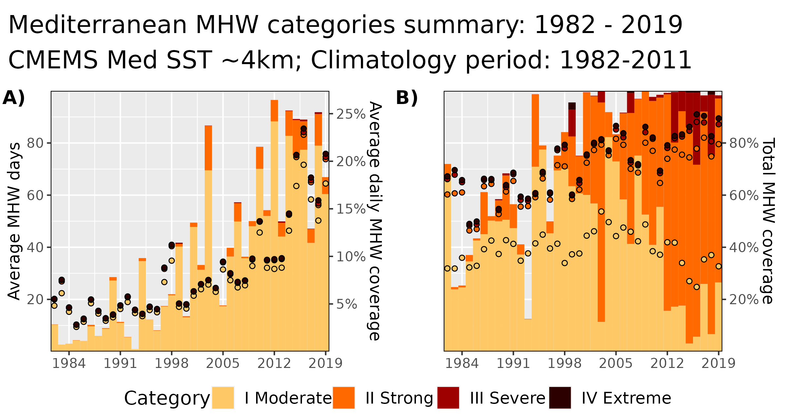
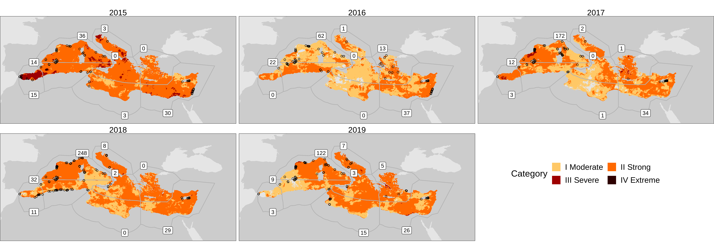
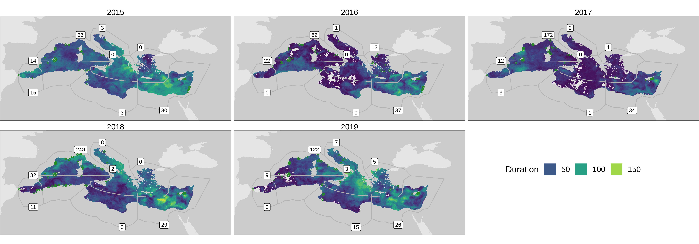

```{r global_options, include = FALSE}
knitr::opts_chunk$set(fig.width = 6, fig.align = 'center',
                      warning = FALSE, message = FALSE, 
                      tidy = FALSE)
```

<br>

# SST product
***
A sea-surface temperature (SST) product was used for the spatial analysis of marine heatwaves (MHWs) at the surface of the Mediterranean.

- Name: Mediterranean SST Analysis L4
- Date range: 1982-01-01 to 2019-12-31
- Spatial resolution: ~ 4 km
- Temporal resolution: daily
- Spatial coverage: 18.1°W - 36.2°E; 30.3°N - 46.0°N
  - Includes a bit of the Atlantic
  - Excludes the Black Sea

<br>

# MHW  {.tabset .tabset-fade .tabset-pills}
***
- Temperature at a location exceeds the 90th percentile for a given calendar day, for 5+ days, with no more than a 2 day gap 

> "A prolonged discrete anomalously warm water event that can be described by its duration, intensity, rate of evolution, and spatial extent." [@Hobday2016]  
  
  
## Metrics {-}

See Table 2 in @Hobday2016 for a full list of metrics.

- Count (n): The number of discrete events in a period of time
- Duration (days): The number of days a single event lasts for
- Mean intensity (°C): The average temperature anomaly during an event
- Maximum intensity (°C): The highest temperature anomaly during the event
- Cumulative intensity (°C days): The sum of the temperature anomalies
- Rate onset (°C/day): Daily increase in temperature from start to peak of event
- Rate decline (°C/day): Daily decrease from peak to end of event

<br>

## Anatomy {-}

{ width=100% }

<br>

## Categories {-}

{ width=100% }

<br>

# Full Med {.tabset .tabset-fade .tabset-pills}  
***
## Summaries {-}

{ width=100% }

<br>

## Categories {-}

{ width=100% }

<br>

## Duration {-}

{ width=100% }

<br>

# NW Med {.tabset .tabset-fade .tabset-pills}
***

## Surface area {-}

{ width=100% }

## Duration {-}

{ width=100% }

## Cum. intensity {-}

{ width=100% }

<!-- - Time series of the 5 year period + MHWs -->

<br>

# Catalan Coast {.tabset .tabset-fade .tabset-pills}  
***

## Total area {-}

{ width=100% }

<br>

## Per site {-}

{ width=100% }

<br>

# Next steps
***
- MHW statistics for targeted areas of ecological interest
  - Will need to work together to determine these areas
- Basic comparison of MMEs and MHWs
  - Do they occur in the same/neighbouring ecoregions?
  - Do they occur in the same/neighbouring seasons?

<br>

# References
***
